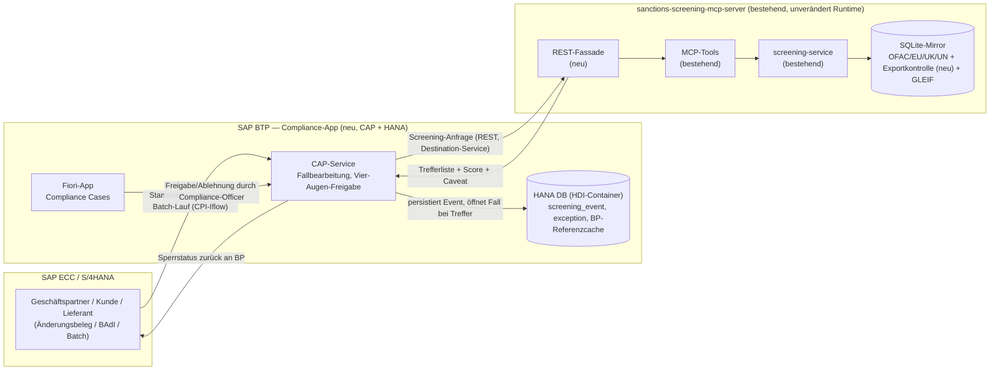
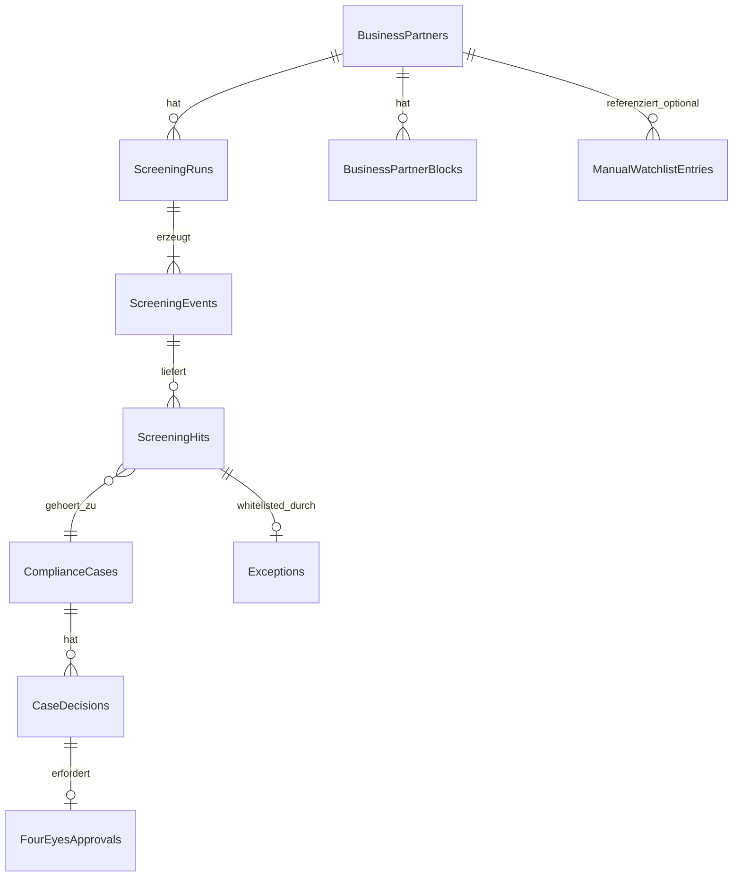

# Konzept: SAP-Integration & Erweiterung — sanctions-screening-mcp-server

Status: Entwurf/Diskussionsgrundlage. Baut auf dem bestehenden TypeScript/Bun-MCP-Server auf (siehe [design.md](./design.md)) statt einer Neuentwicklung in Spring Boot/Java. Ziel: den Server so erweitern, dass er Geschäftspartner-/Kunden-/Lieferanten-Screening für SAP ECC und S/4HANA bedienen kann — inkl. Exportkontrolle, Aktualisierungs- und Audit-Anforderungen.

> **Entscheidung getroffen:** SAP ist das führende System. Die Compliance-Anwendung (Audit-Trail, Fallbearbeitung, Freigaben/Whitelisting) wird deshalb als **CAP-App auf SAP BTP mit HANA DB** betrieben — das passt zur führenden Systemlandschaft, zu SAP-nativer Autorisierung/Fiori-Anbindung und löst gleichzeitig das in [Produktionstauglichkeit von SQLite](#produktionstauglichkeit-von-sqlite--differenziert-nach-schicht) benannte Problem der Audit-Schicht. Der bestehende MCP-Server bleibt davon unberührt die Screening-Engine (Matching, Mirror) — er muss nicht in Java/CAP neu geschrieben werden, sondern wird der Compliance-App über die neue REST-Fassade als Dienst zur Verfügung gestellt.

---

## Ausgangslage: was schon da ist

| Anforderung aus der Anfrage | Bereits abgedeckt? | Wo |
|:--|:--|:--|
| EU-, OFAC-, UN-, UK-Sanktionslisten | Ja | `ofac-service`, `eu-fsf-service`, `uk-sanctions-service`, `un-sc-service` |
| Namensvergleich (Fuzzy Matching) | Ja | `text-matching.ts` — Jaro-Winkler + Double-Metaphone, strict/fuzzy |
| Synchronisation/Aktualisierung der Listen | Ja | `MirrorService`, `bun run mirror:refresh`, Cron (`SANCTIONS_REFRESH_CRON`) |
| SAP ECC/S4HANA-Integration | Nein | neu zu bauen |
| SAP BTP Deployment | Entschieden — für die Compliance-App (Audit/Fallbearbeitung), nicht zwingend für die Screening-Engine | neu zu bauen: CAP-App + HANA |
| CAP- oder Spring-REST-API | Nein — MCP/JSON-RPC ist vorhanden, keine "flache" REST-API | neu zu bauen |
| Screening bei Geschäftspartnern/Kunden/Lieferanten | Nein — Server kennt nur "Name screenen", keine BP-Fachlogik | neu zu bauen |
| Ausfuhr-/Embargoprüfung | Nein — nur Sanktionslisten, keine Exportkontroll-/Dual-Use-Listen | neu zu bauen |
| Audit-/Compliance-Anforderungen | Teilweise — Caveat + Score vorhanden, aber kein Audit-Trail/Historie | zu erweitern |

Die Kernaussage: **Matching-Engine und Datenhaltung müssen nicht neu gebaut werden.** Die Lücke liegt in (1) einer SAP-konsumierbaren Schnittstelle, (2) BP-spezifischer Fachlogik (Screening-Auslöser, Ausnahmen, Historie) und (3) zusätzlichen Exportkontroll-Quellen.

---

## Produktionstauglichkeit von SQLite — differenziert nach Schicht

Wichtige Unterscheidung, die auch die CDS-Frage oben prägt: **SQLite ist nicht pauschal ein Risiko** — es kommt darauf an, welche der beiden Datenschichten gemeint ist.

| Schicht | Workload-Charakter | SQLite geeignet? |
|:--|:--|:--|
| **Sanktions-/GLEIF-Mirror** (bestehend) | Read-mostly; Schreibzugriffe nur beim geplanten Cron-Refresh, nicht pro Anfrage. Bleibt während eines laufenden Refreshs transaktional lesbar (WAL-Modus + `busy_timeout`, framework-seitig). Datenvolumen (10⁴–10⁷ Zeilen) liegt im vorgesehenen Zielbereich. | **Ja, unverändert geeignet.** Genau der Anwendungsfall, für den die eingesetzte `MirrorService`-Architektur gebaut ist. |
| **Neue Audit-/Exception-Schicht** (`screening_event`, `exception`) | Echte Schreibzugriffe pro Anfrage (jedes Screening-Event, jede Freigabe), potenziell aus mehreren Instanzen gleichzeitig. | **Nein, hier sind die Bedenken berechtigt.** Single-Writer-Charakter und fehlendes Mehrbenutzer-Locking über Instanzen hinweg passen nicht zu einem Compliance-Audit-Trail mit Nachweispflicht. |

Zusätzliche Einschränkung unabhängig von der Schicht: SQLite ist eine **Datei**, kein Client-Server-System. Sobald der Service mit mehreren Instanzen betrieben wird (z. B. mehrere Pods auf BTP Cloud Foundry/Kyma für Verfügbarkeit), braucht jede Instanz ihre eigene lokale Kopie der Mirror-Datei — geteilter Zugriff über Netzwerk-Storage (NFS/EFS) ist riskant. Es gibt zudem keine eingebaute Replikation/Failover; ein Verlust des Volumes erfordert ohne Backup ein neues, stundenlanges `mirror:init`.

**Empfehlung:** Mirror bleibt SQLite (kein Änderungsbedarf). Die Audit-/Exception-Schicht sollte production-seitig von Anfang an auf einer Client-Server-DB liegen (HANA, falls Richtung BTP/CAP; sonst Postgres) — unabhängig davon, ob dafür CDS eingesetzt wird oder nicht. Für den Mirror selbst reicht bei echtem Mehrinstanz-Bedarf ein Verteilungsmechanismus (zentraler Refresh, Datei an alle Instanzen replizieren) statt eines DB-Wechsels.

---

## Architekturüberblick



**Kernentscheidung:** Zwei getrennte Systeme mit klarer Verantwortung. Der MCP-Server bleibt Single Source of Truth für Matching und Sanktions-/GLEIF-Mirror und läuft unverändert auf seinem Node/Bun-Stack. Die neue Compliance-App (Audit-Trail, Fallbearbeitung, Freigabe-Workflow, Fiori-UI) läuft als CAP-Service auf BTP mit HANA und ruft den MCP-Server ausschließlich über die neue REST-Fassade auf — nie über MCP/JSON-RPC direkt. Keine Parallelimplementierung der Matching-Logik in ABAP/Java/CAP.

**Warum REST und nicht MCP für diese Verbindung:** Der Aufruf Compliance-App → Screening-Engine ist ein deterministischer Backend-zu-Backend-Call innerhalb eines Geschäftsprozesses, keine agentische Tool-Nutzung durch ein LLM — dafür ist MCP (Session-Handshake, Tool-Discovery, auf Agenten-Verständlichkeit optimierte Beschreibungen) nicht gebaut. CAP konsumiert externe Services zudem nativ als REST/OpenAPI (`cds.connect.to`), und Service-zu-Service-Auth (Destination-Service/OAuth-Client-Credentials/Cloud Connector) passt zu Standard-HTTP, nicht zu den bewusst unterschiedlichen, agentenorientierten Auth-Modellen der beiden MCP-Server (keyless beim Screening-Server, XSUAA-Scopes beim Compliance-MCP). MCP bleibt in diesem Konzept auf die beiden "Fronttüren" für Agenten beschränkt — den bestehenden Screening-MCP-Server und den neuen Compliance-MCP-Server; die Verbindung dazwischen ist immer REST.

---

## Datenmodell: CDS/HANA — wo sinnvoll, wo nicht

Die Frage "Datenmodell auf CDS umstellen, damit HANA nutzbar wird" muss pro Datenschicht separat beantwortet werden — es gibt zwei fachlich und technisch unterschiedliche Schichten in diesem Konzept.

| Schicht | Auf CDS umstellen? | Begründung |
|:--|:--|:--|
| **Sanktions-/GLEIF-Mirror + Matching-Engine** (bestehend) | **Nein** | Die Matching-Logik (FTS5, Jaro-Winkler, Double-Metaphone) ist an SQLite-spezifische Mechanismen der Framework-`MirrorService` gebunden. HANA hat eigene, potenziell bessere Fuzzy-/Volltextsuch-Fähigkeiten (Fuzzy Search, `CONTAINS`/`SCORE`), aber das ist eine andere API mit anderem Verhalten — ein CDS-Modell würde die Matching-Logik nicht automatisch mitportieren. Der eigentliche Aufwand (HANA-native Matching-Implementierung) fiele so oder so an; CDS löst hier nicht das eigentliche Problem. Zusätzlich zöge es den vollen `@sap/cds`-Laufzeit-Stack in ein bisher SAP-freies Projekt (neuer Build-Schritt, neue Laufzeitabhängigkeit). |
| **Neue Audit-/Exception-Schicht** (`screening_event`, `exception`, ggf. BP-Referenzcache) | **Ja — entschieden.** Läuft als eigene CAP-App auf BTP mit HANA DB. | Einfache relationale Entitäten ohne exotische Anforderungen — genau CAPs Kernfall (lokal SQLite für Dev/Test, produktiv HANA, ein Modell). CDS-Annotationen (`@requires`, `@restrict`) passen gut zum geforderten Vier-Augen-Prinzip bei Freigaben, und OData-Exposure kommt für eine Fiori-Case-App "gratis" mit. |

**Konsequenz für die Umsetzungsreihenfolge:** Das Audit-/Exception-Modul entsteht als **eigenständige CAP-App** (eigenes Deployment, eigene HDI-Container-Schema auf HANA), die über die neue REST-Fassade mit dem MCP-Server spricht — kein Umbau des bestehenden Mirrors, keine gemeinsame Codebasis. Die beiden Systeme bleiben durch die REST-Grenze sauber getrennt: die CAP-App besitzt Audit-Trail, Fallbearbeitung und Freigabe-Workflow; der MCP-Server bleibt alleiniger Eigentümer von Matching und Sanktions-/GLEIF-Mirror.

---

## Deployment-Optionen

Anforderungen, an denen sich jede Option messen lassen muss: (1) **persistenter Speicher** für die SQLite-Mirror-Datei (`SANCTIONS_MIRROR_PATH`), (2) **ausgehender HTTPS-Zugriff** auf die fünf keylosen Quellen (OFAC/EU/UK/UN/GLEIF) fürs Refreshen, (3) **erreichbar von der Compliance-App** auf BTP für die REST-Fassade, (4) ein **immer laufender Prozess** für den Refresh-Cron (`schedulerService` läuft im Serverprozess — Scale-to-Zero-Plattformen brauchen stattdessen einen externen Trigger für `mirror:refresh`).

| Option | Wie | Persistenter Speicher | Netzwerk zur Compliance-App (BTP) | Bewertung |
|:--|:--|:--|:--|:--|
| **Docker, selbst gehostet** (VM/eigenes Rechenzentrum) | Vorhandenes `Dockerfile` direkt nutzen, Volume mounten | Docker-Volume/Bind-Mount — unkompliziert | Öffentlicher Endpoint oder Cloud Connector/Site-to-Site-VPN zu BTP nötig | Einfachster, sofort lauffähiger Weg — passt zum aktuellen Stand (`bun run start:http`, Dockerfile vorhanden). Ops-Aufwand liegt komplett beim eigenen Team. |
| **SAP BTP, Cloud Foundry** | `cf push` mit Docker-Image oder Node-Buildpack | Kein natives persistentes Dateisystem auf CF — braucht Volume-Service oder externen Storage-Bind | **Im selben Subaccount wie die Compliance-App** — interne Route möglich, kein Cloud Connector nötig | Netzwerktechnisch die engste Anbindung an die CAP-App; Storage-Frage muss aber gelöst werden (Volume-Service oder Umzug des Mirrors auf einen Objekt-/Dateidienst). |
| **SAP BTP, Kyma (Kubernetes)** | Vorhandenes `Dockerfile` als Pod, `PersistentVolumeClaim` für den Mirror | PVC — passt direkt zum Docker-Modell | Gleiche Landschaft wie CF-Option, zusätzlich volle Kontrolle über CronJob für den Refresh | Bester BTP-Fit, wenn das SAP-Team ohnehin Kubernetes betreibt: gleiches Image wie beim Docker-Betrieb, aber mit BTP-Netzwerknähe zur Compliance-App. |
| **Azure Container Apps** | Vorhandenes `Dockerfile` deployen, Azure Files als Volume-Mount | Azure Files Volume-Mount | Cloud Connector/Site-to-Site-VPN oder öffentlicher Endpoint mit Auth zu BTP | Guter Kompromiss aus wenig Betriebsaufwand und Kubernetes-ähnlicher Flexibilität. **Scale-to-Zero vermeiden** oder Refresh über eine separate Azure Container Apps Job (statt des eingebauten Schedulers) triggern. |
| **Azure App Service (Linux, Custom Container)** | Vorhandenes `Dockerfile`, Storage-Mount für den Mirror | Azure Files Mount (App Service Storage) | Wie oben | Etwas weniger flexibel als Container Apps/AKS, aber geringster Konfigurationsaufwand, wenn schon Azure-App-Service-Landschaft existiert. |
| **AKS / andere verwaltete Kubernetes-Angebote (auch AWS EKS, ECS Fargate + EFS)** | Gleiches Container-Image, PVC/EFS für den Mirror | Ja | Wie Azure Container Apps | Sinnvoll, falls eine zentrale Cloud-Plattform-Abteilung (nicht das SAP-Team) den Betrieb übernimmt und bereits auf Kubernetes/AWS setzt. Funktional gleichwertig zu Kyma, nur andere Betriebsverantwortung. |
| **Spring Boot / CAP-Neuimplementierung der Screening-Engine** | — | — | — | Nicht empfohlen: würde Matching-Engine, Ingestion und Mirror-Logik komplett duplizieren — hoher Aufwand ohne fachlichen Mehrwert gegenüber der REST-Fassade. |

**Richtungsentscheidung:** Screening-Engine läuft voraussichtlich ebenfalls auf BTP. Für den Fall, dass sie (übergangsweise oder dauerhaft) außerhalb von BTP betrieben wird, ist sie über **Cloud Connector** an die Compliance-App angebunden — dasselbe Muster, das ohnehin für die on-premise ECC-Anbindung gebraucht wird (siehe unten). Die Wahl zwischen den folgenden Optionen ist damit kein Entweder-Oder mehr, sondern vor allem eine Frage, **wer den Betrieb übernimmt**:

- **Übernimmt das SAP-Betriebsteam den Betrieb** (naheliegend, da BTP ohnehin für die Compliance-App genutzt wird): **BTP Kyma**, weil PVC direkt zum bestehenden Docker-Modell passt und die Netzwerknähe zur CAP-App am größten ist (keine Cloud-Connector-Konfiguration nötig).
- **Übernimmt eine zentrale Cloud-Plattform-Abteilung** (Azure/AWS bereits Standard im Haus): **Azure Container Apps** (oder AKS bei Bedarf an mehr Kontrolle) — dann läuft die Anbindung an die Compliance-App über Cloud Connector, und der Refresh-Cron sollte über eine externe Job-Triggerung statt des eingebauten Schedulers laufen, falls Scale-to-Zero aktiv ist.
- **Kein bestehendes Cloud-Ops-Team / kleiner Rahmen**: einfacher **Docker-Betrieb auf einer VM** — geringste Einstiegshürde, gleiches Image wie alle anderen Optionen, spätere Migration auf Kyma/Azure bleibt möglich, ohne die Anwendung selbst zu ändern.

In allen Fällen bleibt die Screening-Engine unverändert im bestehenden Node/Bun-Stack; es ändert sich nur, wo der Container läuft und wie der Mirror persistiert wird.

---

## Neue Komponente: REST-Fassade für SAP

Ziel: eine schmale, stabile REST-API, die intern die bestehenden MCP-Tools aufruft (`sanctions_screen_name`, `sanctions_list_sources`, künftig `export_control_screen_name`). Kein zweiter Fachkern — reines Adapter-/Übersetzungslayer.

| Endpoint | Methode | Zweck | Ruft intern auf |
|:--|:--|:--|:--|
| `/api/v1/screening/business-partner` | POST | Screening für einen Geschäftspartner (Name, Land, Rolle: Kunde/Lieferant/Sonstige) | `sanctions_screen_name` (+ künftig Exportkontroll-Quellen) |
| `/api/v1/screening/business-partner/{bpId}/history` | GET | Screening-Historie eines BP (Audit) | neuer `screening_history`-Service |
| `/api/v1/screening/batch` | POST | Batch-Screening (z. B. nächtlicher Lauf über gesamten BP-Bestand) | `sanctions_screen_name` pro Zeile, asynchron |
| `/api/v1/exceptions/{bpId}` | GET/POST | False-Positive-/Whitelist-Verwaltung | neuer `exception-service` |
| `/api/v1/sources` | GET | Freshness/Status der geladenen Listen | `sanctions_list_sources` |

Warum REST statt MCP direkt: ABAP-Systeme (ECC, S/4HANA on-prem) und SAP Integration Suite sprechen klassisches REST/OData deutlich einfacher als MCP/JSON-RPC; MCP bleibt die Schnittstelle für Agenten/LLM-Clients, REST die Schnittstelle für klassische SAP-Middleware. Beide Fassaden laufen im selben Prozess gegen dieselbe `screening-service`-Instanz.

---

## MCP-Erweiterung auf die Compliance-Schicht — Best Practice

Ja, MCP sollte auch die Compliance-Schicht (Fallbearbeitung, Freigaben, Historie) abdecken — aber **nicht als zusätzliche Tools im bestehenden `sanctions-screening-mcp-server`**, sondern als **eigener, zweiter MCP-Server**, der bei der neuen CAP-App auf BTP mitläuft. Ein Agent kann dann in einer Sitzung beide Server ansprechen (Screening + Compliance), so wie das Design-Dokument den bestehenden Server bereits als einen von mehreren zusammenarbeitenden Servern im "Fleet" beschreibt.

**Warum nicht im bestehenden Server:** Der ist bewusst keyless, read-only, ohne Auth und ohne Mandantenbezug — genau das Gegenteil der Compliance-Schicht (mandantenspezifisch, autorisiert, mit echten Schreiboperationen). Beides in einem Server zu vermischen verwässert die Vertrauens- und Sicherheitsgrenze des jetzigen, öffentlich nutzbaren Screening-Servers.

**Best Practice für den Compliance-MCP-Server:**

| Aspekt | Empfehlung |
|:--|:--|
| Hosting | Als Node.js-Companion der CAP-App auf BTP — liest/schreibt direkt gegen HANA, kein Umweg über eine dritte Schicht. |
| Tool-Bias | Überwiegend lesend: `compliance_get_case`, `compliance_list_open_cases`, `compliance_screening_history`. Deckt den Hauptagenten-Use-Case ("Stand der Prüfung zeigen") ohne Schreibrisiko. |
| Schreibende Tools | Zurückhaltend, mit `readOnlyHint: false`/`destructiveHint`, striktem Input-Schema. Kein Tool, das einen Fall final freigibt/schließt — ein Agent kann höchstens einen Vorschlag mit Status `pending` anlegen (`compliance_propose_exception`); die tatsächliche Freigabe bleibt Menschenaufgabe (Fiori). Dieselbe "Kandidat, keine Entscheidung"-Logik wie beim Screening-Caveat, übertragen auf die Freigabe. |
| Auth/Mandantenfähigkeit | Im Gegensatz zum Screening-Server: MCP-Auth mit Scopes (OAuth/XSUAA), `ctx.tenantId` zur Isolierung zwischen Mandanten/Gesellschaften. |
| Audit-Konsistenz | Jede MCP-ausgelöste Aktion schreibt in dieselbe `screening_event`/`exception`-Tabelle wie die Fiori-UI — keine Sonderbehandlung, weil die Aktion vom Agenten statt von einem Menschen kam. |
| Human-in-the-loop | Schreibende Tools nutzen `ctx.requestInput`, um vor der Ausführung explizit nachzufragen, statt in einem Zug durchzuschreiben. |

---

## SAP ECC / S/4HANA Integrationsmuster

> **Parallelbetrieb vorausgesetzt:** Aktuell ist SAP ECC EHP8 im Einsatz, mittelfristig ist die Migration auf SAP S/4HANA Public Cloud geplant. Beide Anbindungen müssen deshalb von Anfang an vorgesehen werden, nicht nacheinander — das Datenmodell trägt dem bereits Rechnung (`BusinessPartners.sourceSystem: ecc | s4hana`). Die beiden Systeme unterscheiden sich grundlegend in der erlaubten Erweiterbarkeit und brauchen deshalb unterschiedliche technische Auslöser-Muster, münden aber in denselben `ScreeningRuns`/`ScreeningEvents`-Fluss.

| Aspekt | SAP ECC EHP8 (on-premise) | SAP S/4HANA Public Cloud |
|:--|:--|:--|
| Erweiterbarkeitsmodell | Klassische ABAP-Erweiterung: BAdI, User-Exit, Change Documents — voll verfügbar | **Clean Core**: kein kundeneigenes ABAP im Kernsystem. Nur In-App-Extensibility (eingeschränkte Key-User-Tools) oder Side-by-Side-Extensibility auf BTP |
| Neuanlage/Änderung Geschäftspartner | BAdI `BUPA_ADDRESS`/`BUPA_SCREEN_UPDATE` bzw. Change-Document-Event → CPI-Iflow (über Cloud Connector erreichbar) → REST-Call | Freigegebenes Business Event (z. B. `sap.s4.beh.businesspartner.v1.BusinessPartner.Changed.v1`) über **SAP Event Mesh** → Side-by-Side-Extension auf BTP konsumiert Event → REST-Call |
| Bestandsdaten (Altdaten) | Nächtlicher Batch-Export (BP/Kunde/Lieferant-Tabellen) → Batch-Endpoint | Batch-Abfrage über freigegebene Communication Scenario/API (OData, SAP API Business Hub) → Batch-Endpoint |
| Bestellung/Auftrag mit neuem Geschäftspartner | Synchroner Check vor Belegsicherung (User-Exit/BAdI im SD/MM-Beleg) | Nur möglich, wenn eine passende In-App-Extensibility-Erweiterungsstelle im jeweiligen Cloud-Prozess freigegeben ist — sonst nachgelagerter Check nach Belegsicherung über das Event |
| Netzwerkanbindung an Compliance-App/BTP | Über **Cloud Connector** (ECC ist on-premise/privates Netz) | Direkt über BTP-interne Kommunikation (Communication Arrangement, OAuth) — kein Cloud Connector nötig |

**Konsequenz:** Zwei unterschiedliche Adapter im Eingangskanal der Compliance-App — ein CPI/Cloud-Connector-Pfad für ECC, ein Event-Mesh-Pfad für S/4HANA Public Cloud —, die beide auf dasselbe generische `ScreeningRuns`/`ScreeningEvents`-Modell münden. Das Datenmodell muss dafür nicht geändert werden, nur der Eingangskanal ist verdoppelt zu bauen und zu betreiben, solange beide Quellsysteme parallel laufen.

**Ergebnis-Rückmeldung nach SAP:** unabhängig vom Quellsystem gleich — Sperrkennzeichen setzen (Zentrale Sperre BP), Fiori-App/Workflow für manuelle Prüfung bei Treffer. Kein automatisches Blockieren bei `approximate`-Treffern — Caveat bleibt: Treffer ist Kandidat, keine Entscheidung.

**Wichtig, konsistent mit bestehendem Caveat:** Ein Treffer darf in SAP nicht automatisch zu einer harten Sperre führen, sondern zu einem Review-Workflow (z. B. Fiori "My Compliance Cases" oder Workflow-Task). Die Entscheidung "Blockieren/Freigeben" bleibt beim Compliance-Officer — der Server liefert Kandidaten mit Score und Quelle, keine Verdikte. Das deckt sich 1:1 mit `SCREENING_CAVEAT` im bestehenden Server.

---

## Bestehende Lösung: idProve (Rausoft) — Koexistenz und Ablösestrategie

Aktuell wird **idProve (Rausoft)** für die Sanktionslistenprüfung eingesetzt. Das hier beschriebene Konzept ersetzt diese Funktion fachlich vollständig (Screening-Engine + Compliance-App) — es braucht also eine explizite Übergangsstrategie statt eines harten Cutover-Stichtags.

| Phase | Inhalt |
|:--|:--|
| Parallelbetrieb | Neue Lösung screent testweise dieselben Geschäftspartner/Vorgänge mit wie idProve, ohne produktiv in SAP zurückzuwirken — Vergleich der Trefferlisten (Abdeckung, False-Positive-Rate) über einen definierten Zeitraum |
| Abnahmekriterien | Mindestens gleichwertige Trefferabdeckung auf den vier Sanktionslisten (OFAC/EU/UK/UN) und der neuen Exportkontroll-Quelle (BIS), bevor idProve für einen Geschäftsprozess abgeschaltet wird |
| Cutover | Schrittweise pro Geschäftsprozess (z. B. zuerst Neuanlage Geschäftspartner, dann Bestandsdaten-Batch, zuletzt Bestellprozess) statt in einem Schritt für die gesamte Landschaft |
| Lizenz-/Vertragsende | Laufzeit-/Kündigungsfristen des idProve-Vertrags früh klären — bestimmt den spätest sinnvollen Cutover-Termin unabhängig vom technischen Fortschritt |
| Datenübernahme | Zu klären: müssen bestehende idProve-Fallhistorien/Freigaben in `ComplianceCases`/`Exceptions` migriert werden, oder startet der Audit-Trail bewusst mit dem Go-Live neu? |

GTS (SAP Global Trade Services) ist bestätigt **nicht im Einsatz** — die Exportkontroll-Ingestion (BIS Entity/DPL/Unverified List, siehe oben) ist damit eine reine Eigenentwicklung im MCP-Server, ohne Anbindung an ein bestehendes GRC-Modul.

---

## Ausfuhr- und Embargoprüfung (neue Quellen)

Sanktionslisten und Exportkontrolllisten sind fachlich unterschiedliche Prüfungen, sollten aber dieselbe Mirror-/Matching-Infrastruktur nutzen (gleiches Muster wie die vier bestehenden Sanktionsquellen).

| Quelle | Zweck | Format/Bezug |
|:--|:--|:--|
| US BIS Entity List / Denied Persons List / Unverified List | US-Exportkontrolle (dual-use, Re-Export) | CSV/XML, `bis.doc.gov`, keyless |
| EU Dual-Use-Verordnung (2021/821), Anhang I/IV | EU-Güterlisten für genehmigungspflichtige Güter | Kein Namens-Screening, sondern güterbezogen (ECCN/AL-Nummer) — andere Fachlogik als Namensmatching |
| Länderembargos (EU/UN/US Comprehensive Sanctions Programs, z. B. Kuba, Nordkorea, Iran, Syrien, Russland-Sektor) | Länder-/Regionsbezogene Sperre, unabhängig von Namenstreffer | Meist als Metadaten der bestehenden Sanktionsquellen (Programmfeld) ableitbar, teils eigene Listen |

Empfehlung für den ersten Ausbauschritt: **Namensbasierte Ergänzung** (BIS Entity/Denied Persons/Unverified List) nach demselben Muster wie `ofac-service` etc. als neuer Ingest-Service (`bis-service`) in den bestehenden `designation`-Schema-Ansatz einhängen, mit eigenem `source`-Code (`us_bis_entity`, `us_bis_dpl`, `us_bis_unverified`). Güterlisten (Dual-Use-VO) sind eine eigene Prüfdimension (ECCN-Klassifizierung von Materialien, nicht Namensmatching) und sollten als separates Feature später bewertet werden — sie passen nicht in die bestehende Namens-Matching-Engine.

Länderembargo-Prüfung kann größtenteils aus vorhandenen Feldern (`program`, Land der Adresse in `payload`) abgeleitet werden, ergänzt um eine statische Embargo-Länderliste als Konfigurationsobjekt.

---

## Audit- und Compliance-Anforderungen

Aktuell fehlt: **jede Screening-Anfrage/-Antwort ist heute flüchtig** (kein persistenter Log über den Request hinaus, abgesehen vom Server-Log). Für SAP-Compliance-Prozesse (z. B. Nachweispflicht bei Wirtschaftsprüfung/Zoll) braucht es einen echten Audit-Trail — das ist jetzt fachlich die Aufgabe der neuen CAP-App auf BTP/HANA, nicht des MCP-Servers.

| Anforderung | Umsetzung (in der CAP-App, CDS-Modell auf HANA) |
|:--|:--|
| Nachvollziehbarkeit jeder Prüfung | `screening_event`-Entität: wer/was wurde wann mit welchem Ergebnis geprüft, welche Listenversion (as-of-Timestamp aus `sanctions_list_sources`, von der REST-Fassade mitgeliefert) war aktiv |
| Unveränderlichkeit (append-only) | Kein Update/Delete auf `screening_event` — nur Insert (z. B. via CDS `@readonly`/Event-Handler, der Änderungen ablehnt); Historie bleibt auch nach Freigabe/Whitelisting erhalten |
| Whitelisting/False-Positive-Handling | `exception`-Entität: BP-ID + Treffer-ID + Begründung + Freigeber + Gültigkeitsdauer; Re-Screening prüft weiterhin, markiert aber bekannte Ausnahmen statt sie zu verstecken |
| Nachweis der Listenaktualität | `sanctions_list_sources` liefert bereits As-of-Timestamps — bei jedem Audit-Event mitschreiben, damit belegbar ist, mit welchem Datenstand geprüft wurde |
| Aufbewahrungsfristen | Konfigurierbare Retention (z. B. 10 Jahre je nach Jurisdiktion) — Audit-Daten der CAP-App unterliegen einem eigenen Retention-Zyklus, unabhängig vom Sanktions-Mirror-Refresh des MCP-Servers |
| Vier-Augen-Prinzip bei Freigabe | CDS-Autorisierung (`@requires`, `@restrict`) trennt Rollen "prüft" (Sachbearbeiter) und "gibt frei" (Compliance-Officer) auf Entitätsebene |
| Reporting | Aggregierte Sicht (Anzahl Prüfungen, Trefferquote, offene Fälle) — CDS-View auf `screening_event`, per Fiori/Analytics konsumierbar |

Das ist der größte inhaltlich neue Baustein — und liegt bewusst außerhalb des MCP-Servers. Der bleibt zustandslos/read-only ("keine Schreiboperationen, da der Datenbestand upstream-owned ist"); der Audit-Trail betrifft nicht die Sanktionsdaten selbst, sondern lebt vollständig in der neuen CAP-App auf BTP/HANA.

---

## Datenmodell Compliance-App (CDS)

Konkretisierung der oben genannten Entitäten `screening_event`/`exception` zu einem vollständigen Modell. Deckt drei Anforderungen ab: (1) jede Prüfung dokumentieren, (2) Treffer in einen manuellen Review-Workflow geben, (3) manuelle Einträge und Sperren unabhängig von einem automatisierten Treffer setzen können.



```cds
namespace compliance;

using { cuid, managed } from '@sap/cds/common';

/** Geschäftspartner-Referenzcache — repliziert aus SAP ECC/S4HANA, nicht führend. */
entity BusinessPartners : cuid, managed {
  sapBusinessPartnerId : String(10)  @title: 'BP-Nummer (SAP)';
  name                 : String(120);
  country              : String(2);
  role                 : String(20) enum { customer; vendor; other; };
  sourceSystem         : String(20) enum { ecc; s4hana; };
  runs                 : Association to many ScreeningRuns   on runs.businessPartner = $self;
  blocks               : Association to many BusinessPartnerBlocks on blocks.businessPartner = $self;
}

/** Ein Auslöser (Realtime-Trigger, Batch-Lauf, manueller Re-Check) — Klammer um 1..n Screening-Events. */
entity ScreeningRuns : cuid, managed {
  businessPartner : Association to BusinessPartners;
  triggerType     : String(20) enum { realtime; batch; manual; };
  triggeredBy     : String(120) @title: 'User oder Job-Name';
  events          : Composition of many ScreeningEvents on events.run = $self;
}

/** Append-only: eine Zeile pro tatsächlich ausgeführter Prüfung gegen die Screening-Engine. Kein Update/Delete. */
entity ScreeningEvents : cuid {
  run             : Association to ScreeningRuns;
  businessPartner : Association to BusinessPartners;
  queryName       : String(200) @title: 'gescreenter Name';
  matchMode       : String(10)  enum { strict; fuzzy; };
  sourcesQueried  : String(200) @title: 'z.B. ofac_sdn,eu,uk,un';
  sourcesAsOf     : LargeString @title: 'JSON-Snapshot von sanctions_list_sources zum Prüfzeitpunkt';
  executedAt      : Timestamp;
  hitCount        : Integer;
  screeningStatus : String(20) enum { screened; not_ready; error; };
  hits            : Composition of many ScreeningHits on hits.event = $self;
}

/** Ein einzelner Kandidat aus einem Screening-Event — Kandidat zur Verifikation, keine Entscheidung. */
entity ScreeningHits : cuid {
  event           : Association to ScreeningEvents;
  source          : String(20)  @title: 'ofac_sdn / eu / uk / un / us_bis_entity / ...';
  sourceEntryId   : String(60);
  matchType       : String(20)  enum { exact; strong; approximate; };
  matchedName     : String(200);
  score           : Decimal(4,3) @title: 'roher Jaro-Winkler-Wert, nur bei approximate';
  program         : String(200);
  designationDate : Date;
  reviewStatus    : String(20)  enum { open; confirmed_match; false_positive; escalated; } default 'open';
  case            : Association to ComplianceCases;
}

/** Fall zur manuellen Prüfung — wird automatisch angelegt, sobald ein Screening-Event Treffer mit reviewStatus=open liefert. */
entity ComplianceCases : cuid, managed {
  businessPartner : Association to BusinessPartners;
  event           : Association to ScreeningEvents;
  status          : String(20) enum { open; in_review; pending_approval; closed; } default 'open';
  priority        : String(10) enum { low; medium; high; } default 'medium';
  assignedTo      : String(120);
  hits            : Association to many ScreeningHits on hits.case = $self;
  decisions       : Composition of many CaseDecisions on decisions.case = $self;
}

/** Die eigentliche manuelle Entscheidung eines Sachbearbeiters zu einem Treffer. */
entity CaseDecisions : cuid, managed {
  case      : Association to ComplianceCases;
  hit       : Association to ScreeningHits;
  decision  : String(20) enum { confirmed_match; false_positive; escalate; };
  comment   : LargeString;
  decidedBy : String(120);
  decidedAt : Timestamp;
  approval  : Composition of one FourEyesApprovals on approval.decision = $self;
}

/** Vier-Augen-Freigabe: proposedBy und approvedBy müssen unterschiedliche User sein (Handler-seitig erzwungen). */
entity FourEyesApprovals : cuid {
  decision   : Association to CaseDecisions;
  proposedBy : String(120);
  approvedBy : String(120);
  status     : String(20) enum { pending; approved; rejected; } default 'pending';
  decidedAt  : Timestamp;
}

/** Whitelist/False-Positive mit Gültigkeitsdauer — verbirgt einen Treffer nicht, sondern markiert ihn als bekannt/geprüft. */
entity Exceptions : cuid, managed {
  businessPartner : Association to BusinessPartners;
  hit             : Association to ScreeningHits;
  justification   : LargeString;
  approvedBy      : String(120);
  validFrom       : Date;
  validUntil      : Date;
  status          : String(20) enum { active; expired; revoked; } default 'active';
}

/** Manuelle Sperre eines Geschäftspartners — unabhängig von einem automatisierten Treffer, z.B. auf Basis externer Erkenntnisse. */
entity BusinessPartnerBlocks : cuid, managed {
  businessPartner : Association to BusinessPartners;
  reason          : LargeString;
  blockedBy       : String(120);
  blockedAt       : Timestamp;
  liftedBy        : String(120);
  liftedAt        : Timestamp;
  status          : String(20) enum { active; lifted; } default 'active';
}

/** Manuell gepflegte Zusatzliste (internes Denylist) — ergänzt die vier offiziellen Sanktionslisten um firmeneigene Einträge. */
entity ManualWatchlistEntries : cuid, managed {
  name       : String(200);
  aliases    : LargeString @title: 'kommagetrennt oder JSON-Array';
  reason     : LargeString;
  category   : String(20) enum { person; organization; vessel; aircraft; other; };
  addedBy    : String(120);
  active     : Boolean default true;
  validUntil : Date;
}

/** Technisches, unveränderliches Protokoll jeder schreibenden Aktion in der Compliance-App (auch MCP-Tool-Aufrufe). */
entity AuditLogs : cuid {
  entityName  : String(60);
  entityKey   : String(36);
  action      : String(30) @title: 'z.B. case.decide, block.set, exception.approve';
  performedBy : String(120);
  performedAt : Timestamp;
  payload     : LargeString @title: 'JSON-Snapshot der Änderung';
}
```

**Zusammenspiel der Entitäten:**

| Anforderung aus der Anfrage | Abgedeckt durch |
|:--|:--|
| Prüfungen dokumentieren | `ScreeningRuns` + `ScreeningEvents` (append-only, inkl. Listen-Snapshot `sourcesAsOf`) |
| Treffer zur manuellen Prüfung geben | `ScreeningHits.reviewStatus = open` erzeugt automatisch einen `ComplianceCases`-Eintrag; Sachbearbeiter entscheidet über `CaseDecisions` |
| Vier-Augen-Prinzip bei Entscheidungen | `FourEyesApprovals` — `proposedBy ≠ approvedBy`, per Handler erzwungen, nicht nur per UI-Konvention |
| Manuell Einträge setzen | `ManualWatchlistEntries` — eigene, firmengepflegte Zusatzliste neben den vier offiziellen Quellen |
| Manuell Sperren setzen | `BusinessPartnerBlocks` — unabhängig von einem Screening-Treffer, jederzeit durch einen Compliance-Officer setz- und aufhebbar |
| Bekannte Treffer nicht wiederholt eskalieren | `Exceptions` — zeitlich befristete Whitelist pro Treffer, verbirgt den Treffer nicht, sondern markiert ihn |
| Nachvollziehbarkeit auch für Agenten-Aktionen | `AuditLogs` — protokolliert jede schreibende Aktion unabhängig davon, ob sie über Fiori-UI oder den Compliance-MCP-Server ausgelöst wurde |

**Wichtige Designentscheidungen:**

- **`ScreeningEvents` und `ScreeningHits` sind strikt append-only** — kein CDS-Update/Delete-Handler dafür vorgesehen; Korrekturen laufen ausschließlich über neue `CaseDecisions`/`Exceptions`, nie über Änderung der Rohdaten.
- **`ComplianceCases` entsteht automatisch, nie manuell** — ein Fall ist immer die Folge eines Treffers (`ScreeningHits.reviewStatus = open`) oder wird explizit über eine manuelle Sperre (`BusinessPartnerBlocks`) ausgelöst; es gibt keinen Weg, einen Fall ohne zugrundeliegenden Treffer oder manuelle Sperre zu "erzeugen", um lückenlose Nachvollziehbarkeit sicherzustellen.
- **Manuelle Einträge/Sperren sind bewusst getrennte Entitäten** (`ManualWatchlistEntries`, `BusinessPartnerBlocks`), nicht Teil von `Exceptions`: Eine Sperre ist das Gegenteil einer Freigabe/Whitelist und braucht ein eigenes Schema (Grund, gesetzt von, aufgehoben von) statt eines Sonderfalls im Whitelist-Modell.
- **`BusinessPartners` ist ein Referenzcache, keine führende Instanz** — Namensänderungen etc. kommen aus SAP; die Compliance-App überschreibt niemals SAP-Stammdaten, sie hängt nur Prüf- und Fallhistorie daran.

---

## Vorschlag Umsetzungsreihenfolge

1. **REST-Fassade** über bestehende Tools (`screen_name`, `list_sources`) — kein neues Fachwissen, nur Adapter. Schnell lieferbar, macht den Server für die CAP-App und SAP CPI testbar.
2. **CAP-App auf BTP mit HANA** aufsetzen: CDS-Modell für `screening_event`/`exception`/BP-Referenzcache, HDI-Container, Grundgerüst für Fallbearbeitung + Vier-Augen-Freigabe. Voraussetzung für jeden produktiven Compliance-Einsatz.
3. **Fiori-App** für Compliance-Fallbearbeitung auf Basis des CAP-Service (OData kommt mit CDS-Modellierung mit).
4. **SAP-Integrationsmuster** (CPI-Iflow oder direkter ABAP-HTTP-Call, BAdI-Trigger bei BP-Änderung, Batch-Job für Bestandsdaten) — in Abstimmung mit dem SAP-Team, welches Muster (Realtime vs. Batch) zuerst gebraucht wird; Zielsystem für den Aufruf ist jetzt die CAP-App, nicht direkt der MCP-Server.
5. **Exportkontroll-Quellen** (BIS Entity/DPL/Unverified List) als neuer Ingest-Service nach bestehendem Muster im MCP-Server.
6. **Deployment der Screening-Engine** (weiter Node/Bun-Hosting, ggf. ebenfalls auf BTP) — unabhängig von der CAP-App, kann parallel laufen.

---

## Offene Fragen für die nächste Konkretisierungsrunde

- Welches SAP-System ist führend für Geschäftspartnerdaten in der Übergangszeit — bleibt ECC EHP8 federführend bis zur vollständigen S/4HANA-Public-Cloud-Migration, oder laufen beide Systeme mit eigenen Geschäftspartnerbeständen parallel?
- Soll das Screening synchron blockierend (vor Belegsicherung) oder asynchron mit Nachbearbeitung laufen — ggf. unterschiedlich je Quellsystem, da S/4HANA Public Cloud einen synchronen Check nur über eine freigegebene Erweiterungsstelle erlaubt?
- Welche Aufbewahrungsfrist gilt für den Audit-Trail (rechtlich/regulatorisch, je nach Branche/Land)?
- Wie lange soll der Parallelbetrieb mit idProve laufen, und wer legt die Abnahmekriterien für den Trefferabgleich verbindlich fest?
- Müssen bestehende idProve-Fallhistorien/Freigaben migriert werden, oder startet der neue Audit-Trail bewusst leer zum Go-Live?
- Ist für die Side-by-Side-Extension auf S/4HANA Public Cloud (Event-Mesh-Konsum) bereits ein Governance-/Freigabeprozess (Clean-Core-Richtlinie) im Haus definiert, an den sich dieses Konzept halten muss?
